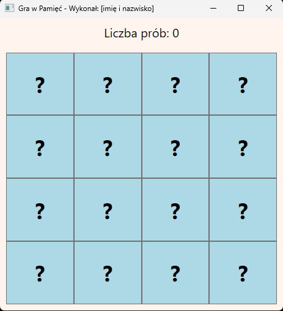
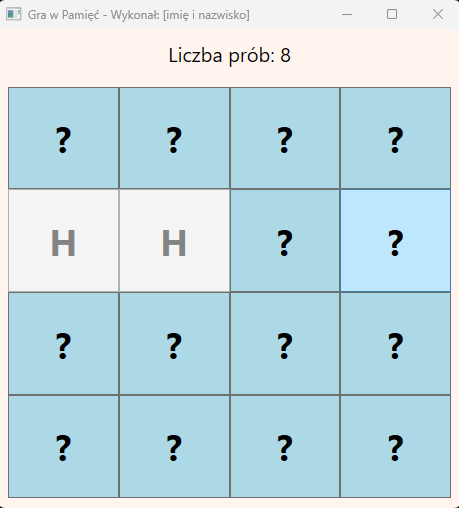
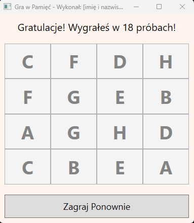

# Zadanie Programistyczne: Gra w pamięć

## Wygląd aplikacji

  
  
  

## Opis wyglądu aplikacji:
1. Tytuł okna: "Gra w Pamięć - Wykonał: [numer zdającego]".
2. Tło okna ma kolor `SeaShell` (#FFF5EE).
3. W górnej części okna znajduje się `TextBlock` o nazwie `StatusText` z tekstem "Liczba prób: 0", czcionką o rozmiarze 20.
4. Poniżej znajduje się plansza do gry w postaci siatki `UniformGrid` 4x4, wypełnionej 16 przyciskami.
5. Wszystkie przyciski na planszy mają początkowo ten sam, pusty tekst lub znak (np. "?") i tło koloru `LightBlue`.
6. Na dole okna znajduje się przycisk "Zagraj Ponownie", który początkowo jest niewidoczny (`Visibility="Collapsed"`).

## Działanie aplikacji:
1. Aplikacja na starcie losowo przypisuje 8 par identycznych symboli (np. "A", "B", "C", ..., "H") do 16 przycisków na planszy. Symbole te są niewidoczne dla gracza.
2. Kliknięcie na przycisk z zakrytą kartą powoduje jej "odkrycie" - w `Content` przycisku pojawia się ukryty symbol.
3. Gracz może mieć jednocześnie odkryte maksymalnie dwie karty. Próba odkrycia trzeciej karty nie powoduje żadnej akcji.
4. Gdy gracz odkryje dwie karty:
    - Jeśli symbole na kartach są identyczne, karty pozostają odkryte, a ich tło zmienia kolor na `LightGreen`.
    - Jeśli symbole są różne, po krótkiej pauzie (np. 1 sekunda, można pominąć pauzę i zakryć je od razu po następnym kliknięciu) obie karty ponownie się zakrywają (ich `Content` znów jest pusty). Każda taka pomyłka zwiększa licznik prób wyświetlany w `StatusText`
5. Gra kończy się, gdy wszystkie pary zostaną odnalezione. `StatusText` wyświetla wtedy komunikat "Gratulacje! Wygrałeś w [liczba] próbach!".
6. Po zakończeniu gry wszystkie przyciski na planszy stają się nieaktywne (`IsEnabled = false`), a przycisk "Zagraj Ponownie" staje się widoczny. Jego kliknięcie resetuje grę do stanu początkowego.
