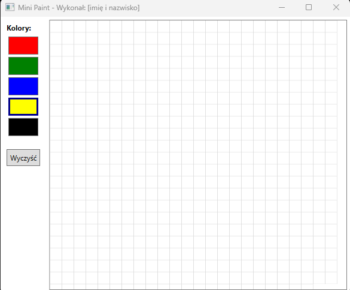
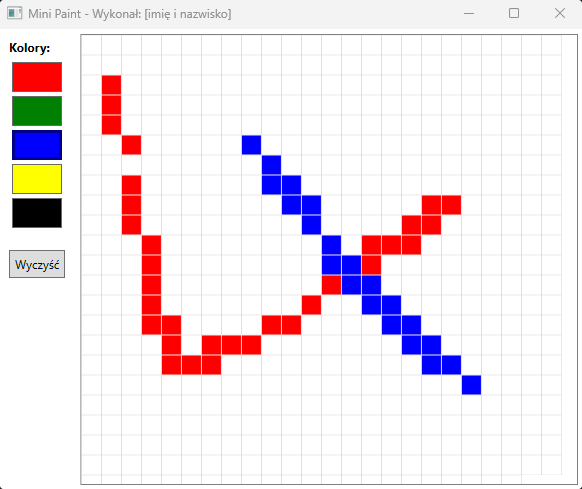

# Zadanie Programistyczne: Prosty edytor graficzny (Mini Paint)

## Wygląd aplikacji

  
  

## Opis wyglądu aplikacji:
1. Tytuł okna: "Mini Paint - Wykonał: [numer zdającego]".
2. Aplikacja jest podzielona na dwie kolumny za pomocą kontrolki `Grid`.
3. W lewej kolumnie znajduje się "paleta kolorów" w postaci 5 przycisków, każdy z innym kolorem tła: `Red`, `Green`, `Blue`, `Yellow`, `Black`. Pod nimi znajduje się przycisk "Wyczyść".
4. W prawej, szerszej kolumnie, znajduje się "płótno" (`Canvas`) wypełnione siatką małych kwadratów (np. 20x20 kontrolek `Border` lub `Label` bez tekstu) o początkowym tle koloru `White`.

## Działanie aplikacji:
1. Na starcie aplikacji aktywnym kolorem jest `Black`.
2. Kliknięcie na dowolny przycisk w "palecie kolorów" ustawia ten kolor jako aktywny do rysowania. Warto zadbać o wizualne oznaczenie aktywnego koloru (np. grubszą ramką).
3. Najazd myszką na dowolny kwadrat na "płótnie" przy wciśniętym lewym przycisku myszy (`MouseMove` z weryfikacją `Mouse.LeftButton == MouseButtonState.Pressed`) zmienia kolor tła tego kwadratu na aktualnie wybrany kolor z palety.
4. Kliknięcie przycisku "Wyczyść" przywraca tło wszystkich kwadratów na płótnie do początkowego koloru `White`.
