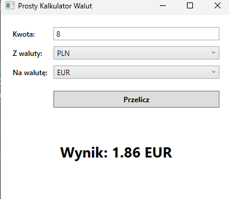
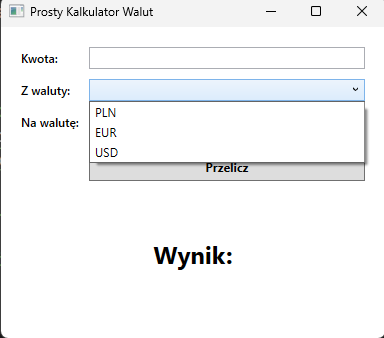

# Zadanie Programistyczne: Prosty kalkulator walut

## Wygląd aplikacji

  
  

## Opis wyglądu aplikacji:
Aplikacja powinna zawierać następujące kontrolki, ułożone w czytelny sposób przy użyciu `Grid`:
1. Etykieta z tekstem "Kwota:".
2. `TextBox` do wpisania kwoty do przeliczenia.
3. **Etykieta** z tekstem "Z waluty:".
4. `ComboBox` z listą walut źródłowych (PLN, EUR, USD).
5. **Etykieta** z tekstem "Na walutę:".
6. `ComboBox` z listą walut docelowych (PLN, EUR, USD).
7. `Button` z napisem "Przelicz".
8. `TextBlock` na wynik, z początkowym tekstem "Wynik:", który będzie aktualizowany po obliczeniach.

## Działanie aplikacji:
1. Po kliknięciu przycisku "Przelicz", aplikacja powinna pobrać dane z kontrolek.
2. Należy zaimplementować podstawową walidację: jeśli pole "Kwota" jest puste lub zawiera tekst, który nie jest liczbą, aplikacja powinna wyświetlić `MessageBox` z odpowiednim komunikatem.
3. Aplikacja ma przeliczyć kwotę na podstawie **ustalonych na sztywno kursów** (nie trzeba pobierać ich z internetu).
    - 1 EUR = 4.30 PLN
    - 1 USD = 4.00 PLN
4. Logika przeliczenia musi uwzględniać wybrane waluty. Przykładowo, przeliczenie z EUR na USD będzie wymagało innego działania niż z PLN na EUR.
5. Wynik powinien zostać sformatowany (np. do dwóch miejsc po przecinku) i wyświetlony w `TextBlock`u.
