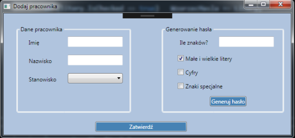
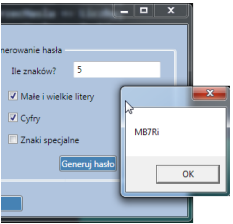
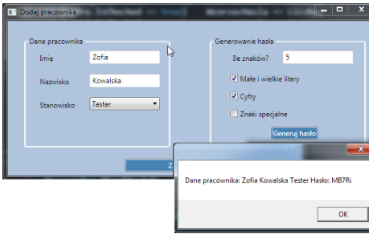

# Arkusz INF.04 - Styczeń 2023 - Aplikacja Desktopowa

## Opis Zadania

Celem jest wykonanie aplikacji desktopowej (w C# WinForms) służącej do wprowadzania danych pracownika, z dodatkową funkcjonalnością generowania dla niego hasła.

  

*(Na obrazie 1 przedstawiono ideę aplikacji. Ostateczny wygląd może się różnić w zależności od użytego środowiska).*

---

## Wymagania: Interfejs Użytkownika

Aplikacja musi posiadać jedno okno główne o następujących cechach:

1.  **Nazwa Okna:** Tytuł okna ma brzmieć "Dodaj pracownika" i zawierać Twój numer zdającego (np. "Dodaj pracownika - 0000").
2.  **Kolorystyka:**
    * Tło całego okna (formularza): `LightSteelBlue` (kod hex: `#B0C4DE`).
    * Tło obu przycisków ("Generuj hasło" i "Zatwierdź"): `SteelBlue` (kod hex: `#4682B4`).
    * Kolor czcionki na obu przyciskach: `Biały`.
3.  **Grupa "Dane Pracownika" (`GroupBox`):**
    * Etykieta `Label` "Imię" oraz pole `TextBox` obok.
    * Etykieta `Label` "Nazwisko" oraz pole `TextBox` obok.
    * Etykieta `Label` "Stanowisko" oraz lista rozwijalna `ComboBox`.
    * `ComboBox` ma zawierać następujące elementy: "Kierownik", "Starszy programista", "Młodszy programista", "Tester".
4.  **Grupa "Generowanie hasła" (`GroupBox`):**
    * Etykieta `Label` "Ile znaków?" oraz pole `TextBox` obok (do wpisania liczby).
    * `CheckBox` z opisem "Małe i wielkie litery" (domyślnie **zaznaczony**).
    * `CheckBox` z opisem "Cyfry".
    * `CheckBox` z opisem "Znaki specjalne".
    * Przycisk `Button` z tekstem "Generuj hasło".
5.  **Przycisk Główny:**
    * Na dole okna musi znajdować się przycisk `Button` z tekstem "Zatwierdź".
    * Przycisk ten ma być wyraźnie dłuższy niż przycisk "Generuj hasło".

---

## Wymagania: Działanie Aplikacji

Aplikacja musi reagować na kliknięcie dwóch przycisków.

### 1. Po kliknięciu przycisku "Generuj hasło":

1.  Program ma odczytać żądaną długość hasła z pola `TextBox` "Ile znaków?".
2.  **Zmienna na hasło:** Hasło musi być przechowywane w zmiennej typu `string` (na poziomie klasy formularza, aby przycisk "Zatwierdź" też miał do niej dostęp).
3.  **Logika generatora:**
    * Hasło ma składać się z losowych **małych liter** alfabetu łacińskiego.
    * Jeśli `CheckBox` "Małe i wielkie litery" jest zaznaczony, **jeden** ze znaków hasła musi być wylosowany z zestawu **wielkich liter**.
    * Jeśli `CheckBox` "Cyfry" jest zaznaczony, **jeden** ze znaków hasła musi być wylosowany z zestawu **cyfr** (`0` do `9`).
    * Jeśli `CheckBox` "Znaki specjalne" jest zaznaczony, **jeden** ze znaków hasła musi być wylosowany z zestawu znaków specjalnych (`!@#$%^&*()_+-=`).
4.  **Uproszczenie (ważne!):** Aby ułatwić zadanie, możesz przyjąć, że np. *pierwszy* znak jest losowany z wielkich liter, *drugi* z cyfr, *trzeci* ze znaków specjalnych, a reszta to małe litery (oczywiście tylko jeśli odpowiednie `CheckBox` są zaznaczone).
5.  **Wyświetlenie hasła:** Wygenerowane hasło należy wyświetlić w oknie dialogowym `MessageBox`.

    

### 2. Po kliknięciu przycisku "Zatwierdź":

1.  Program ma odczytać dane z pól: "Imię", "Nazwisko" oraz "Stanowisko".
2.  Program ma wyświetlić **jedno** okno dialogowe `MessageBox` zawierające zebrane dane pracownika ORAZ wygenerowane wcześniej hasło (zapisane w zmiennej).

    

**Uwaga:** Dla uproszczenia zadania **nie trzeba** implementować walidacji (sprawdzania, czy pola są puste lub czy liczba znaków jest wystarczająca).
